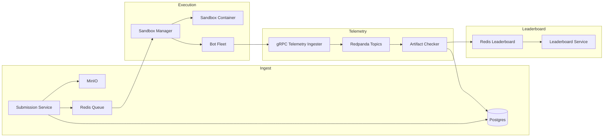
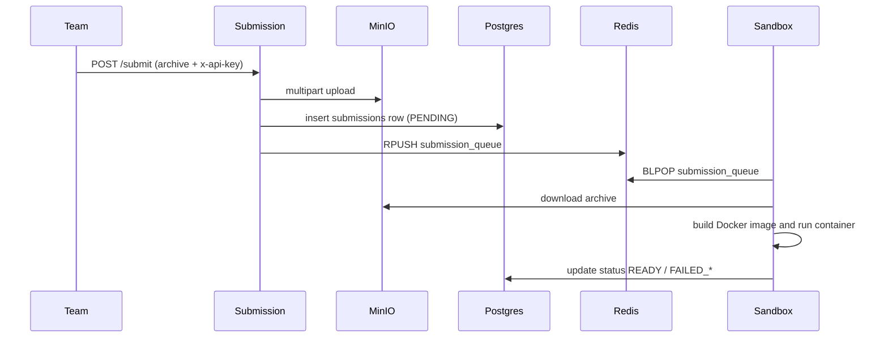
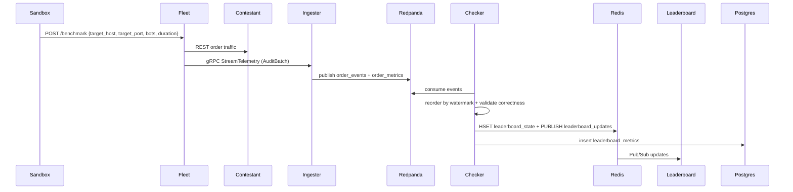

# Veltrix Architecture

## System Overview

Veltrix is a distributed benchmarking platform for contestant trading engines. It safely ingests untrusted submissions, compiles and runs them in isolated sandboxes, drives load with a C++ bot fleet, validates correctness in event-time order, and publishes a live leaderboard.

## Primary Workflows

### Submission and Sandbox Boot

### Benchmark and Telemetry

## Service Architecture Details

### Submission Service (Python, FastAPI)

- Responsibility: authenticate submissions, stream archives to object storage, enqueue sandbox jobs.
- Internal layers:
  - API handlers: `/submit`, `/submission/{id}`, `/health`.
  - Storage adapter: MinIO S3 client for multipart streaming.
  - Persistence: asyncpg for `teams` and `submissions`.
  - Queueing: Redis list `submission_queue`.
- Data flow: incoming multipart upload -> MinIO -> Postgres row -> Redis queue.
- Error handling: invalid API keys (401), invalid language (400), storage exceptions (500).

### Sandbox Manager (Python worker)

- Responsibility: build/run sandboxes, enforce resource limits, trigger benchmarks, update statuses.
- Internal layers:
  - Job poller: BLPOP on `submission_queue`.
  - Safe extraction: zip/tar validation, size limits, no symlinks.
  - Docker build/run: create image and run container on `sandbox-net`.
  - Health probe: TCP port check and failure mapping.
  - Fleet trigger: POST `/benchmark` to bot-fleet.
- Failure modes: `FAILED_STARTUP`, `FAILED_RESOURCE`, `FAILED_LOGIC`, `FAILED_SYSTEM`.

### Bot Fleet (C++20, Boost.Asio io_uring)

- Responsibility: generate load, capture intent/observations, stream telemetry batches.
- Internal layers:
  - FleetCommander: HTTP entrypoint `/benchmark`, spawns per-core workers.
  - ThreadWorker: one OS thread per core, io_uring event loop.
  - RestBot: request generator, tracks order IDs for cancel flows.
  - gRPC client: streams `AuditBatch` to the telemetry ingester.
- Data flow: raw HTTP -> parse response -> create order/trade events -> gRPC.

### Telemetry Ingester (Go)

- Responsibility: ingest gRPC telemetry and publish to Redpanda.
- Internal layers:
  - gRPC `StreamTelemetry` handler.
  - Redpanda producer (franz-go).
  - HTTP health endpoints (`/health`, `/metrics/latest`).
- Data flow: AuditBatch -> split into order events + metrics -> Redpanda topics.

### Artifact Checker (Go)

- Responsibility: reorder events, validate correctness, aggregate metrics, publish leaderboard state.
- Internal layers:
  - Consumer: franz-go for order_events + order_metrics.
  - Watermark router: per-submission event-time reordering.
  - Shadow engine: price-time validation, emits correctness updates.
  - Aggregator: merges latency histograms into p50/p90/p99.
  - Publisher: Redis + TimescaleDB.

### Leaderboard Service (Go)

- Responsibility: render live leaderboard and broadcast updates.
- Internal layers:
  - Redis subscriber: converts JSON payloads to HTML rows.
  - Hub: WebSocket connection registry and broadcast loop.
  - HTTP handlers: `/`, `/leaderboard`, `/ws/leaderboard`, `/health`.

## Data Stores and Topics

### PostgreSQL / TimescaleDB

- `teams`: API keys and team identity.
- `submissions`: submission lifecycle and sandbox endpoint.
- `benchmark_jobs`: persisted benchmark config history.
- `leaderboard_metrics`: time-series leaderboard snapshots (TimescaleDB hypertable).

### Redis

- `submission_queue` (list): sandbox job queue.
- `leaderboard_state` (hash): last known score per submission.
- `leaderboard_updates` (pubsub): live leaderboard updates.

### Redpanda

- `order_events`: order intent/trade events (JSON).
- `order_metrics`: latency counters/histograms (JSON).

## Error Handling and Resilience

- Sandbox failures are mapped to deterministic status codes to separate contestant errors from platform issues.
- Telemetry ingestion uses buffered channels and async Redpanda producer to avoid blocking the bot fleet.
- The leaderboard service recovers from Redis by reading the latest TimescaleDB metrics on connect.

## Local Deployment Topology

Local development runs all services via docker-compose in [veltrix/docker-compose.yml](veltrix/docker-compose.yml). Each service reads from the shared `.env` file in [veltrix/.env](veltrix/.env).
