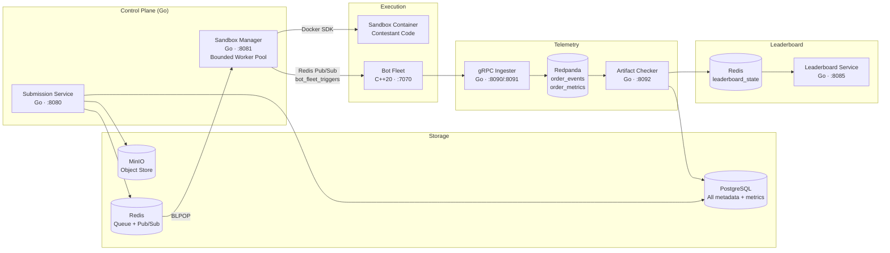
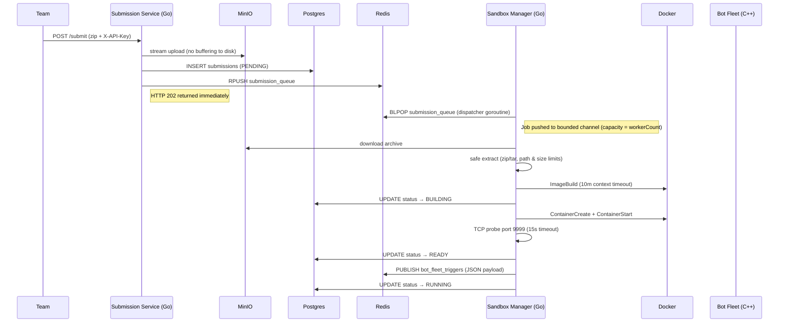
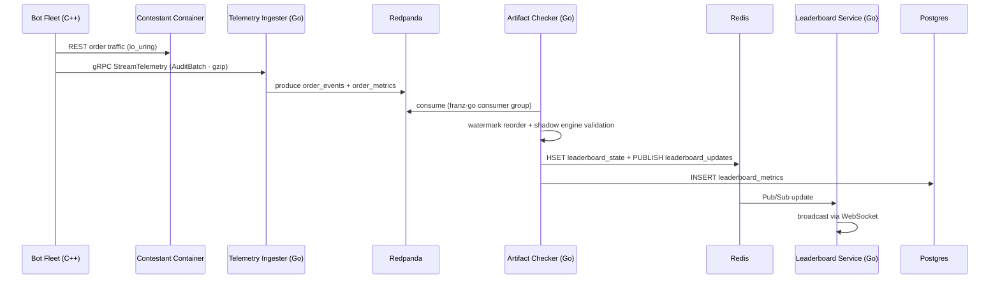

# Veltrix Architecture

## System Overview

Veltrix is a distributed benchmarking platform for contestant trading engines. It safely ingests untrusted submissions, compiles and runs them in isolated sandboxes, drives load with a high-performance C++ bot fleet, validates correctness in event-time order, and publishes a live leaderboard.



## Primary Workflows

### Submission and Sandbox Boot



### Benchmark and Telemetry



## Service Architecture Details

### Submission Service (Go)

- **Language**: Go 1.21, stdlib `net/http`
- **Responsibility**: authenticate submissions, stream archives to MinIO, enqueue sandbox jobs.
- **Internal packages**:
  - `internal/config` — env-driven config with fast-fail on missing required vars.
  - `internal/db` — `pgxpool`-backed PostgreSQL client for `teams` and `submissions`.
  - `internal/storage` — native `minio-go` client; uploads stream directly without buffering to disk.
  - `internal/queue` — Redis client wrapping `RPUSH`/`BLPOP`/`PUBLISH`.
  - `internal/handler` — HTTP handlers for `/submit`, `/submission/{id}`, `/health`.
- **Data flow**: multipart upload → MinIO → Postgres row → Redis `RPUSH` → HTTP 202.

### Sandbox Manager (Go) — Bounded Worker Pool

- **Language**: Go 1.21
- **Architecture**: Bounded Worker Pool via goroutines and channels.
  - One **dispatcher** goroutine owns all `BLPOP` calls and pushes IDs into a buffered `jobs` channel.
  - `CONFIG_WORKER_COUNT` (default: 10) **worker** goroutines read from the channel concurrently.
  - Channel capacity = workerCount → natural **back-pressure**: dispatcher blocks when all workers are busy. No goroutine explosion.
- **Internal packages**:
  - `internal/config` — config with `CONFIG_WORKER_COUNT` for pool sizing.
  - `internal/db` — `pgxpool` client for submission state machine.
  - `internal/storage` — MinIO download client.
  - `internal/archive` — safe zip/tar extractor (path traversal, symlink, size, and count guards).
  - `internal/docker` — Docker SDK wrapper with 10-minute build timeout, TCP startup probe, container lifecycle.
  - `internal/worker` — dispatcher + pool logic.
- **Fleet trigger**: Redis `PUBLISH` to `bot_fleet_triggers` (replaces HTTP `POST /benchmark`).
- **Failure modes**: `FAILED_STARTUP`, `FAILED_RESOURCE`, `FAILED_LOGIC`, `FAILED_SYSTEM`.

### Bot Fleet (C++20, Boost.Asio io_uring)

- **Responsibility**: generate load, capture audit events, stream telemetry.
- **Trigger**: subscribes to Redis `bot_fleet_triggers` Pub/Sub channel (no HTTP dependency).
- **Internal layers**:
  - FleetCommander: Redis subscriber + benchmark launcher.
  - ThreadWorker: one OS thread per core, io_uring event loop.
  - GrpcTelemetryClient: streams `AuditBatch` every 500ms.
- **Data flow**: REST → parse response → `OrderSubmitted`/`TradeExecuted` events → gRPC.

### Telemetry Ingester (Go)

- **Responsibility**: receive gRPC telemetry and publish to Redpanda.
- **Internal packages**: `internal/grpcserver`, `internal/producer`, `internal/pb` (protobuf codegen).
- **Data flow**: `AuditBatch` (gzip) → order events + metrics → Redpanda topics.

### Artifact Checker (Go)

- **Responsibility**: reorder events, validate correctness, publish leaderboard state.
- **Publisher targets**: Redis (leaderboard state/pubsub) + **PostgreSQL** `leaderboard_metrics`.

### Leaderboard Service (Go)

- **Responsibility**: render live leaderboard via WebSocket.
- **Data sources**: Redis Pub/Sub + PostgreSQL for historical metrics.

## Data Stores

### PostgreSQL

PostgreSQL is the **single database** for all persistence. 

| Table | Purpose |
|---|---|
| `teams` | API keys and team identity |
| `submissions` | Submission lifecycle, sandbox endpoint, status codes |
| `benchmark_jobs` | Persisted benchmark config history |
| `leaderboard_metrics` | Time-series leaderboard snapshots (plain table, BRIN-friendly index) |

### Redis

| Key | Type | Owner |
|---|---|---|
| `submission_queue` | List (FIFO) | Submission → Sandbox Manager |
| `bot_fleet_triggers` | Pub/Sub channel | Sandbox Manager → Bot Fleet |
| `leaderboard_state` | Hash | Artifact Checker |
| `leaderboard_updates` | Pub/Sub channel | Artifact Checker → Leaderboard Service |

### MinIO (S3-compatible)

- Bucket `submissions`: raw contestant zip archives.

### Redpanda (Kafka-compatible)

| Topic | Schema | Producer | Consumer |
|---|---|---|---|
| `order_events` | JSON `OrderEventJSON` | Telemetry Ingester | Artifact Checker |
| `order_metrics` | JSON `MetricsJSON` | Telemetry Ingester | Artifact Checker |

## Error Handling and Resilience

- Sandbox failures map to deterministic codes (`FAILED_*`) to separate contestant bugs from platform faults.
- The worker pool provides back-pressure: if all 10 workers are busy, the dispatcher goroutine blocks — preventing unbounded memory growth under job spikes.
- Build timeouts (10 minutes) ensure a stuck contestant Dockerfile cannot permanently hold a worker.
- Telemetry uses buffered channels and async Redpanda producer to prevent the bot fleet from blocking.
- The leaderboard service can recover leaderboard state from PostgreSQL on restart.

## Local Deployment Topology

All services run via `docker compose` in [veltrix/docker-compose.yml](veltrix/docker-compose.yml). Configuration is read from [veltrix/.env](veltrix/.env).

```
localhost:8080  → Submission Service
localhost:8081  → Sandbox Manager (health)
localhost:8085  → Leaderboard Service
localhost:8090  → Telemetry Ingester (HTTP health/metrics)
localhost:8091  → Telemetry Ingester (gRPC)
localhost:8092  → Artifact Checker (health)
localhost:9000  → MinIO S3 API
localhost:9001  → MinIO Console
localhost:5432  → PostgreSQL
localhost:6379  → Redis
localhost:9092  → Redpanda (Kafka)
```
