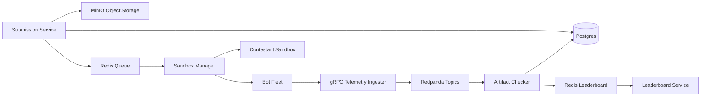

# Veltrix (IICPC) - Distributed Benchmarking Platform

Veltrix is a distributed benchmarking platform for high-frequency trading engines built for the IICPC Summer Hackathon 2026. It securely hosts untrusted submissions, drives deterministic load with a C++ bot fleet, aggregates telemetry with event-time correctness checks, and streams a live leaderboard.

This repository is organized as a monorepo. The production services live under [veltrix/](veltrix/).

## Quick Navigation

- Local setup: [SETUP.md](SETUP.md)
- Running locally: [RUNNING.md](RUNNING.md)
- Troubleshooting: [TROUBLESHOOTING.md](TROUBLESHOOTING.md)
- System architecture: [ARCHITECTURE.md](ARCHITECTURE.md)
- Onboarding guide: [docs/ONBOARDING.md](docs/ONBOARDING.md)
- Service dependency map: [docs/SERVICE_DEPENDENCIES.md](docs/SERVICE_DEPENDENCIES.md)
- Technical debt report: [docs/TECH_DEBT.md](docs/TECH_DEBT.md)

## System Purpose

Veltrix provides a safe, reproducible environment to benchmark contestant orderbooks/matching engines under heavy load while enforcing correctness (price-time priority) and fairness (resource isolation). The platform is designed for local docker-compose development and for production-scale orchestration in the future.

## High-Level Architecture



## Tech Stack

- Python 3.12 (submission-service, sandbox-manager)
- C++20 with Boost.Asio io_uring (bot-fleet)
- Go (telemetry-ingester, artifact-checker, leaderboard-service)
- PostgreSQL + TimescaleDB (metadata, leaderboard metrics)
- Redis (queues, leaderboard cache/pubsub)
- MinIO (submission artifacts)
- Redpanda (Kafka-compatible event bus)
- Docker + docker-compose (local dev)

## Microservices Overview

| Service | Path | Purpose | Ports |
| --- | --- | --- | --- |
| Submission Service | [veltrix/submission-service](veltrix/submission-service) | Ingests submissions, stores artifacts, enqueues sandbox jobs. | 8080 |
| Sandbox Manager | [veltrix/sandbox-manager](veltrix/sandbox-manager) | Builds and runs contestant sandboxes, triggers benchmarks. | 8081 (health) |
| Bot Fleet | [veltrix/bot-fleet](veltrix/bot-fleet) | High-concurrency load generator with gRPC telemetry. | 7070 |
| Telemetry Ingester | [veltrix/telemetry-ingester](veltrix/telemetry-ingester) | Accepts gRPC telemetry, publishes to Redpanda. | 8090, 8091 |
| Artifact Checker | [veltrix/artifact-checker-go](veltrix/artifact-checker-go) | Reorders events, validates correctness, aggregates metrics. | 8092 (health) |
| Leaderboard Service | [veltrix/leaderboard-service](veltrix/leaderboard-service) | Web UI + WebSocket broadcaster for live rankings. | 8085 |

## Repository Layout

```
.
├── veltrix/                 # All microservices and docker-compose
├── docs/                    # Onboarding and technical debt docs
├── SETUP.md
├── RUNNING.md
├── TROUBLESHOOTING.md
└── ARCHITECTURE.md
```