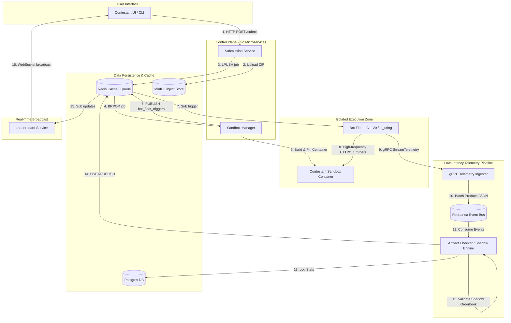
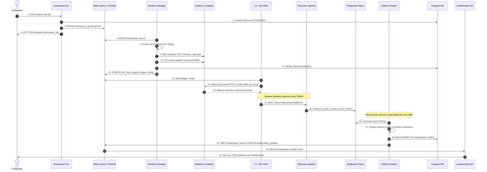
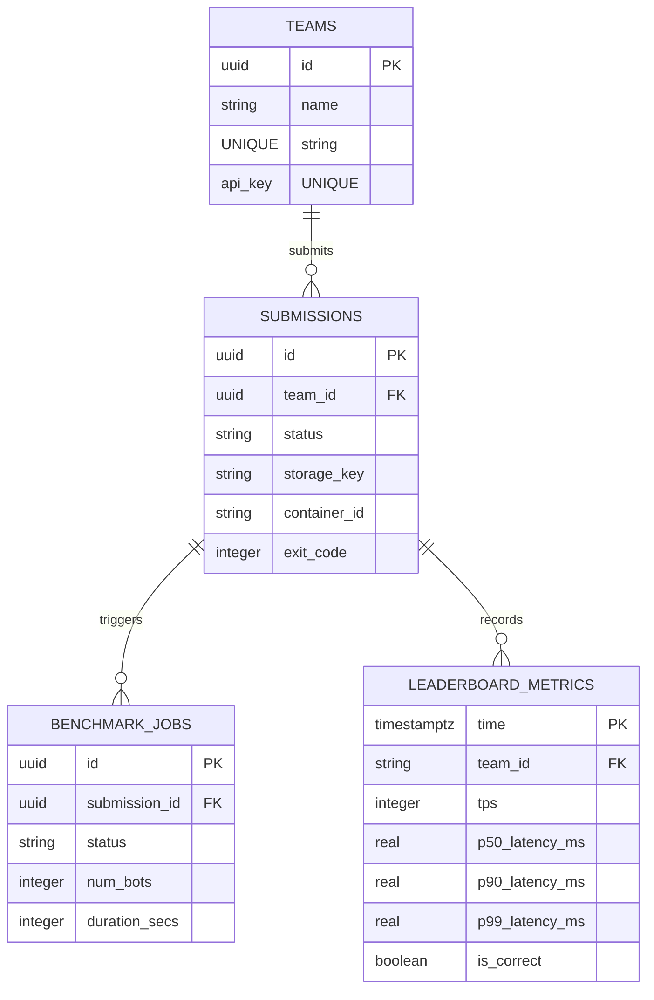
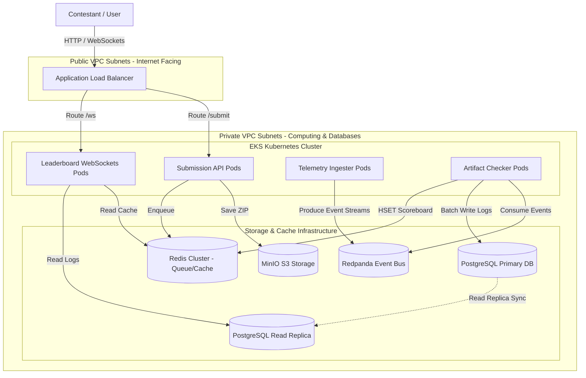
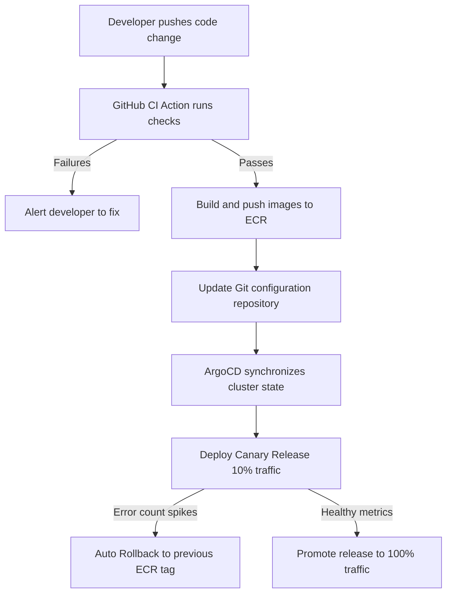

# Software Design Document: Veltrix Distributed Benchmarking and Hosting Platform

## 1. Executive Summary

### 1.1 Problem Statement & Goals
Evaluating contestant-submitted trading matching engines requires a platform that can:
1. **Safely execute untrusted code** without host risk or cross-contestant resource interference.
2. **Generate deterministic, high-throughput load** (tens of thousands of order transactions/sec).
3. **Ingest low-latency telemetry** under heavy load without dropping packets or skewing metrics.
4. **Validate correctness in real-time** (verifying price-time priority) despite out-of-order events.
5. **Publish dynamic updates** to a live leaderboard for participants.

Veltrix is a secure, distributed, and concurrent benchmarking platform designed to scale to 1,000+ teams (10x growth) and peak telemetry ingestion rates of 1,000,000 events/sec.

### 1.2 High-Level Architecture Overview
Veltrix uses an event-driven architecture to separate user-facing components from performance-critical benchmarking code. The Control Plane compiles contestant binaries and spins up Docker sandboxes in isolated networks. The Bot Fleet drives HTTP/1.1 order traffic to the sandboxes and streams microsecond-level telemetry via gRPC. Telemetry events flow through a Redpanda event bus to the Artifact Checker, which verifies execution correctness and updates PostgreSQL and Redis for leaderboard streaming.



#### Detailed Diagram Description:
1. **Submission Ingestion:** The contestant uploads their source ZIP file. The Submission Service writes the file to S3-compatible MinIO storage and puts a build job onto the Redis queue.
2. **Container Orchestration:** The Sandbox Manager dequeues the build task, extracts files, compiles the binary, starts a Docker container with restricted resources (cgroups and locked CPU cores), and publishes a benchmark trigger to Redis.
3. **Stress Testing:** The Bot Fleet receives the trigger via Redis Pub/Sub, opens pooled HTTP connections to the sandbox, and generates high-frequency order traffic. It streams execution metadata to the Telemetry Ingester via gRPC streams.
4. **Validation and Scoring:** The Telemetry Ingester routes events to Redpanda topics. The Artifact Checker consumes the raw events, reorders them using a watermark-based min-heap buffer, runs them through a shadow matching engine, logs performance stats in Postgres, and caches active updates in Redis.
5. **Leaderboard Update:** The Leaderboard Service reads updates from Redis and broadcasts them to all connected contestant browsers via WebSockets.

---

## 2. Requirements Analysis

### 2.1 Functional Requirements (FR)
* **FR-1 (Ingestion):** Authenticate teams, validate and upload archives to MinIO, and enqueue metadata tasks in Redis.
* **FR-2 (Sandboxing):** Retrieve zip archives, compile Docker images, run containers with cgroup resource limits, and probe port readiness.
* **FR-3 (Load Generation):** Dequeue instructions, spawn thread pools, and generate concurrent order traffic.
* **FR-4 (Telemetry):** Capture order submission timestamps, responses, and stream batches to the ingester via gRPC.
* **FR-5 (Reordering & Validation):** Order telemetry events by event-time and replay them on a shadow orderbook.
* **FR-6 (Leaderboard):** Push aggregated TPS, latency, and correctness updates to the UI via WebSockets.

### 2.2 Key Non-Functional Requirements (NFR)
* **10x Scale:** Support up to 1,000 teams and 50 concurrent stress-tests. Telemetry ingestion must scale to 1,000,000 events/sec.
* **Security & Isolation:** Sandbox containers must use read-only root filesystems, have zero network access, run as non-root users (`--user 1000:1000`), and enforce CPU/memory constraints (e.g., 256MB RAM).
* **Performance:** Telemetry reordering buffer latency must not exceed 2,000ms. End-to-end score updates must publish within 2.5 seconds of execution.

---

## 3. System Architecture & Boundaries

### 3.1 Service Boundaries
* **Submission Service (Go):** Exposes `/submit` and `/submission/{id}` REST APIs. Handles archive validation and storage.
* **Sandbox Manager (Go):** Manages sandboxed container cycles using the Docker/Kubernetes API. Enforces cgroup limits.
* **Bot Fleet (C++20):** High-speed asynchronous I/O driver (`io_uring`) that generates order traffic and streams metrics via gRPC.
* **Telemetry Ingester (Go):** Receives gRPC streams, decompresses payloads, and publishes to Redpanda topics.
* **Artifact Checker (Go):** Consumes Redpanda streams, reorders events, replays them on a shadow orderbook, and updates databases.
* **Leaderboard Service (Go):** Exposes WebSocket endpoints for real-time leaderboard score broadcasts.

### 3.2 Failure Handling & Fault Tolerance
* **Build Timeouts & Quotas:** Enforce a 10-minute compile timeout. ZIP extractions terminate if file bounds (>50MB) are exceeded.
* **Worker Pools:** The Sandbox Manager implements a bounded worker pool to prevent host resource exhaustion.
* **Redpanda Buffer:** Ingesters buffer events in memory during Redpanda outages. The Checker can rebuild state by replaying logs from its last committed partition offset.

---

## 4. Technology Stack Decisions

| Layer | Technology | Alternatives | Tradeoffs & Justification |
|---|---|---|---|
| **Control Plane** | Go 1.21 | Python, Java | Go offers fast startup, clean concurrency, and a native Docker SDK with minimal memory overhead. |
| **Load Generator** | C++20 (io_uring) | Rust, Go | C++ bypasses GC pauses, and `io_uring` reduces kernel context-switch overhead to maintain microsecond accuracy. |
| **Telemetry Bus** | Redpanda | Kafka, RabbitMQ | Redpanda offers a thread-per-core C++ design, Kafka compatibility, and operates without JVM/ZooKeeper overhead. |
| **Primary Database**| PostgreSQL 16 | TimescaleDB | Standardizing on Postgres with BRIN indexes avoids clustered database management complexity. |
| **Cache & Queue** | Redis 7 | RabbitMQ | Low-latency queueing and native Pub/Sub for real-time WebSocket distribution. |
| **Object Storage** | MinIO | Local storage | Lightweight, self-hosted S3-compatible API for distributed file retrieval. |

---

## 5. Detailed Component & Data Design

### 5.1 Component Specifications
* **Submission Service:** Stateless Go API. Streams archives directly to MinIO and enqueues jobs in the Redis list `submission_queue`.
* **Sandbox Manager:** Orchestration worker. Listens on `submission_queue`, executes builds, runs isolated containers, and publishes triggers to Redis channel `bot_fleet_triggers`.
* **Bot Fleet:** C++20 engine. Reads triggers, runs thread pools, loads endpoints, and streams gRPC `AuditBatch` payloads to the ingester.
* **Telemetry Ingester:** Go service. Accepts gRPC streams and writes events to Redpanda topics `order_events` and `order_metrics`.
* **Artifact Checker:** Go pipeline. Consumes Redpanda events, orders them via a watermark-based min-heap queue, replays them on a shadow orderbook, writes to Postgres, updates the Redis hash `leaderboard_state`, and alerts the channel `leaderboard_updates`.
* **Leaderboard Service:** Go WebSocket server. Listens to `leaderboard_updates` and pushes JSON updates to clients.

### 5.2 Component Interaction Flow
This sequence diagram details the end-to-end messaging flow from the moment a contestant submits code to the real-time leaderboard broadcast.



#### Step-by-Step Flow Description:
1. **Submission & Queueing (Steps 1–4):** The contestant submits their zipped code. The Submission Service writes the metadata to Postgres and the job payload to Redis before returning an HTTP 202 status.
2. **Compilation & Initialization (Steps 5–10):** The Sandbox Manager extracts the ZIP, compiles the target matching engine, starts the container on a dedicated CPU core, and publishes a trigger to the Bot Fleet.
3. **Execution & Telemetry Capture (Steps 11–15):** The Bot Fleet executes order loads using asynchronous I/O and streams telemetry data containing order request and fill events to the Ingester via gRPC.
4. **Validation & Storage (Steps 16–19):** The Artifact Checker reads events from Redpanda, orders them by timestamp, and validates them against a shadow orderbook. Validated statistics are stored in Postgres and cached in Redis.
5. **Real-time Distribution (Steps 20–21):** The Leaderboard Service consumes update alerts from Redis and broadcasts the updated scoreboards to all WebSocket clients.

---

## 6. Database & API Design

### 6.1 Entity Relationships & Data Model
* **`teams`:** Core registration data (`id`, `name`, `api_key`).
* **`submissions`:** Lifecycle tracking (`id`, `team_id`, `status`, `container_id`, `exit_code`).
* **`benchmark_jobs`:** Settings for execution runs (`id`, `submission_id`, `num_bots`, `duration_secs`).
* **`leaderboard_metrics`:** Time-series performance metadata (`time`, `team_id`, `tps`, `p50_latency_ms`, `p90_latency_ms`, `p99_latency_ms`, `is_correct`).



### 6.2 Indexing & Partitioning
* **BRIN Indexing:** To handle high-velocity telemetry inserts, `leaderboard_metrics` uses a Block Range Index (BRIN) instead of a standard B-Tree:
  ```sql
  CREATE INDEX idx_metrics_team_time ON leaderboard_metrics(team_id, time DESC);
  ```
* **Weekly Partitioning:** `leaderboard_metrics` is partitioned weekly by range on the `time` column. This keeps the active write partition in memory and isolates query scans to the active competition time window.

### 6.3 REST API Endpoints
* `POST /v1/submit` — Submit ZIP archive (Form Multipart, requires API key header `X-API-Key`, returns `202 Accepted` with UUID).
* `GET /v1/submission/{id}` — Poll build/run status (returns status strings: `BUILDING`, `RUNNING`, `SUCCESS`, `FAILED_*`).
* `GET /v1/leaderboard` — Get active rankings (Cached in Redis, returns list of teams, scores, and status).
* `GET /v1/leaderboard/history` — Get historical logs for a team (supports cursor pagination `?limit=50&cursor=timestamp`).

---

## 7. Scalability & Cloud Deployability

### 7.1 Horizontal Scaling & Load Balancing
* **gRPC Load Balancing:** Client streams from the Bot Fleet are distributed across Telemetry Ingester pods using Linkerd/Envoy sidecar proxies.
* **WebSocket Scaling:** Leaderboard services run behind an Application Load Balancer with session stickiness. Redis Pub/Sub synchronizes state changes across all active pods.
* **DB Read-Write Separation:** Route write transactions to the primary Postgres database and historical read queries to read replicas through PgBouncer connection pools.

### 7.2 Deployment Topology (EKS/RDS)
This diagram illustrates the cloud deployment architecture across public and private subnets, detailing the routing layer, computing cluster, and storage backends.



#### Detailed Topology Description:
* **Network Partitioning:** Only the ALB is exposed to the public internet. All application microservices run within private VPC subnets.
* **gRPC Telemetry Isolation:** The Bot Fleet connects directly to the private Telemetry Ingester IP space, keeping performance-critical telemetry traffic off the public internet.
* **Persistent Storage Clustering:** MinIO handles object storage, Redis coordinates job queues and WebSocket broadcasts, and Redpanda manages the telemetry logs. PostgreSQL replica nodes handle reading analytics to keep writing performance high on the primary database node.

### 7.3 System Bottlenecks & Mitigations
* **Socket Exhaustion:** High-velocity traffic can exhaust ports. *Mitigation:* The C++ bot fleet uses TCP connection pooling and persistent keep-alives.
* **DB Write Saturation:** Bulk metric logging can overwhelm disks. *Mitigation:* The Checker accumulates metrics and writes them in batches via PostgreSQL `COPY` commands or multi-row insert buffers.
* **Redpanda Partitioning:** Unbalanced partitions can bottleneck workers. *Mitigation:* Telemetry messages are partitioned using the unique `submission_id` as the routing key, ensuring even distribution across the 6 topic partitions.

---

## 8. CI/CD DevOps Strategy & Risks

### 8.1 CI/CD Pipeline
* **GitHub Actions:** Runs unit tests, lints Go and C++ code (`golangci-lint`, `clang-format`), compiles Docker images, and uploads builds to Amazon ECR.
* **ArgoCD Deployments:** Syncs Kubernetes deployments declaratively. Releases roll out using a 10% canary structure and roll back automatically if error metrics spike.



#### Pipeline Description:
* **Quality Gates:** Code cannot merge without passing the linter and unit tests.
* **Deployment Automation:** ArgoCD monitors the configuration repo and updates the EKS cluster automatically.
* **Safety Net:** If error spikes are detected in the canary release, the system rolls back to the previous stable release.

### 8.2 Architectural Risks & Mitigations

| Risk | Impact | Mitigation Strategy |
|---|---|---|
| **Sandbox Memory Leak** | High | Apply strict memory limits (`--memory=256m`) and disable swap space for container sandboxes. |
| **Telemetry Consumer Lag** | Medium | Scale the Checker horizontally up to the partition count (6) and alert on high offset lag. |
| **Network Timing Skews** | Medium | Use a watermark-based min-heap priority queue in the Checker to reorder events before validation. |
| **Postgres Connection Flooding**| Medium | Deploy PgBouncer in front of PostgreSQL to pool and reuse database connections. |
