# Veltrix — End-to-End Workflow: Submission → Leaderboard

---

## Architecture at a Glance

```mermaid
flowchart TD
    A["👤 Contestant\nPOST /submit\n(X-API-Key + .tar.gz)"] --> B

    subgraph submission-service ["submission-service :8080"]
        B["1. Auth → verify API key\n(Postgres teams table)"]
        B --> C["2. Upload archive → MinIO\n(streaming, no temp disk)"]
        C --> D["3. INSERT PENDING row\n(Postgres submissions)"]
        D --> E["4. RPUSH submission_queue\n(Redis)"]
    end

    E --> F

    subgraph sandbox-manager ["sandbox-manager"]
        F["Dispatcher\nBLPOP submission_queue"]
        F --> G["Worker N\n(bounded pool)"]
        G --> G1["→ status: BUILDING\nDownload archive from MinIO"]
        G1 --> G2["Extract archive safely\n(size/count limits)"]
        G2 --> G3["Render Dockerfile\n(cpp/rust/go)"]
        G3 --> G4["docker build\n(10min timeout)"]
        G4 --> G5["docker run\n(512MB RAM, 1 CPU, 1000 PIDs\nno-new-privileges, all caps dropped)"]
        G5 --> G6["Poll port 9999\n(15s timeout)"]
        G6 --> G7["→ status: READY\nendpoint_url saved to DB"]
        G7 --> H["HTTP POST bot-fleet:7070/benchmark\n+ PUBLISH bot_fleet_triggers (Redis)"]
        G7 --> G8["→ status: RUNNING"]
    end

    H --> I

    subgraph bot-fleet ["bot-fleet (C++)"]
        I["FleetCommander\nspawns N ThreadWorkers"]
        I --> J["Each thread:\nSend HTTP order to sandbox :9999\n(BUY/SELL/CANCEL)"]
        J --> K["Record intent in AuditLog\n(bot order_id, side, price, qty)"]
        K --> L["Parse response fills\nlog_trade(..., aggressor_order_id=last.order_id)"]
        L --> M["record() counters\n→ HDR histogram (18 buckets)\nTimeouts: counter only, no histogram"]
        M --> N["Every 500ms:\ngRPC AuditBatch → telemetry-ingester\n(gzip-compressed protobuf stream)"]
    end

    N --> O

    subgraph telemetry-ingester ["telemetry-ingester :8091"]
        O["StreamTelemetry gRPC handler\nReceives AuditBatch"]
        O --> P1["PublishOrderEvents\nOrderSubmitted → JSON → order_events topic\n(Kafka/Redpanda)"]
        O --> P2["PublishTradeEvents\nTradeExecuted + aggressor_order_id → JSON\n→ order_events topic"]
        O --> P3["PublishMetrics\nMetricsBatch → JSON → order_metrics topic"]
    end

    P1 --> Q
    P2 --> Q
    P3 --> R

    subgraph artifact-checker ["artifact-checker"]
        Q["Consumer\nPolls order_events from Redpanda\ndecodes → OrderEvent channel"]
        R["Consumer\nPolls order_metrics\ndecodes → MetricsBatch channel"]

        Q --> S["Router\nDemux by submission_id\n→ per-submission channel"]
        S --> T["Watermark Processor\n(per submission)\nMin-heap, 2s lateness window\nEmits events in event-time order"]

        T --> U["Shadow Engine\n(per submission)"]
        U --> U1["BUY/SELL → recordIntent()\nsave intent + snap bestOpposing"]
        U --> U2["FILL → validateFill()\njoin via AggressorOrderID\n✓ Volume conservation\n✓ Limit-price bound\n✓ (optional) Price-time priority"]
        U --> U3["CANCEL → tolerated\n(server IDs ≠ bot IDs)"]
        U2 --> V["CorrectnessUpdate\n{submission_id, is_correct}"]

        R --> W["Aggregator\nmerge per-thread MetricsBatches\nevery flush interval:\nTPS = http200Delta / elapsed_secs\nP50/P90/P99 from 18-bucket HDR histogram"]
        V --> W

        W --> X["Score emitted\n{submission_id, TPS, P50, P90, P99, correct}"]
    end

    X --> Y

    subgraph publisher ["artifact-checker → Publisher"]
        Y["Async INSERT → Postgres\nleaderboard_metrics\n(team_id, tps, p50, p90, p99, is_correct)"]
        Y --> Z["Redis pipeline:\nHSET leaderboard_state submission_id payload\nPUBLISH leaderboard_updates payload"]
    end

    Z --> AA

    subgraph leaderboard-service ["leaderboard-service :8085"]
        AA["RedisSubscriber\nSUBSCRIBE leaderboard_updates"]
        AA --> AB["Render row.html template\n(HTMX OOB swap fragment)"]
        AB --> AC["WebSocket Hub\nbroadcast to all connected browsers"]
        AC --> AD["Browser\nHTMX OOB swap → updates table row"]
    end

    style submission-service fill:#1a1a2e,color:#e2e8f0
    style sandbox-manager fill:#16213e,color:#e2e8f0
    style bot-fleet fill:#0f3460,color:#e2e8f0
    style telemetry-ingester fill:#533483,color:#e2e8f0
    style artifact-checker fill:#1b4332,color:#e2e8f0
    style publisher fill:#1b4332,color:#e2e8f0
    style leaderboard-service fill:#7b2d00,color:#e2e8f0
```



---

## Phase 1 — Submission Intake (`submission-service`)

**Trigger:** Contestant runs:
```bash
curl -X POST http://localhost:8080/submit \
  -H "X-API-Key: test-api-key-1234" \
  -F "language=cpp" \
  -F "file=@submission.tar.gz"
```

**What happens, step by step:**

| Step | Code | Action |
|---|---|---|
| 1 | `handler.go` | Reads `X-API-Key` header, queries `teams WHERE api_key = $1` |
| 2 | `handler.go` | Parses multipart form (32MB in-memory buffer) |
| 3 | `storage.go` | Streams archive directly to **MinIO** at key `{team_id}/{submission_id}/{filename}` — no temp disk write |
| 4 | `db.go` | `INSERT INTO submissions (id, team_id, language, status='PENDING', storage_key)` |
| 5 | `queue.go` | `RPUSH submission_queue {submission_id}` (Redis) |
| 6 | `handler.go` | Returns HTTP 202 `{"submission_id": "...", "status": "PENDING"}` |

The response is instant. All heavy work is asynchronous.

---

## Phase 2 — Sandboxing (`sandbox-manager`)

**Trigger:** Redis `submission_queue` has a new item.

The sandbox-manager runs a **bounded worker pool**: one dispatcher goroutine does all `BLPOP` calls, pushes IDs into a buffered channel (capacity = `workerCount`). Worker goroutines pull from the channel. If all workers are busy, the dispatcher blocks — preventing unbounded goroutine growth.

**Inside `process()` for one submission:**

### Step 1 — BUILDING
```
status → BUILDING
Download archive from MinIO → /tmp/veltrix-build-*/submission.archive
```

### Step 2 — Extract (safely)
`archive.Extract()` with hard limits:
- Max total bytes extracted
- Max single file size
- Max file count

This prevents zip bomb attacks.

### Step 3 — Build Docker image
A Dockerfile is **rendered in code** based on `language`:

```
cpp  → Ubuntu 22.04 + g++ + cmake → cmake build → must produce ./build/server
rust → rust:1.78-slim             → cargo build  → must produce ./target/release/server
go   → golang:1.22                → go build      → must produce ./server
```

Build timeout: **10 minutes**. Any failure → `status = FAILED_SYSTEM`.

### Step 4 — Run the container
```go
// Resource limits enforced by Docker:
Memory:      512MB
NanoCPUs:    1 core (1e9 nanocpus)
PidsLimit:   1000
CapDrop:     ALL
SecurityOpt: no-new-privileges:true
NetworkMode: sandboxNetwork (isolated)
```

The container **must bind to port 9999** within 15 seconds, or it's killed → `FAILED_STARTUP`.

### Step 5 — READY + trigger bot-fleet
```
status → READY
endpoint_url = "http://sandbox-{submission_id}:9999"

→ HTTP POST bot-fleet:7070/benchmark {submission_id, target_host, num_bots, duration_secs}
→ PUBLISH bot_fleet_triggers (Redis Pub/Sub — for any other subscribers)

status → RUNNING
```

### Step 6 — Scheduled cleanup
After `duration_secs + 300s`, a goroutine:
- Sets `status = SUCCESS` (if still RUNNING)
- Calls `docker stop` + `docker rm` + removes the image

---

## Phase 3 — Benchmarking (`bot-fleet`, C++)

**Trigger:** `FleetCommander` receives the HTTP POST on `/benchmark`.

The C++ bot-fleet spawns N `ThreadWorker` goroutines (actually C++ async tasks). Each thread independently hammers the contestant's sandbox:

### The per-thread hot loop
```
1. Construct an order (BUY/SELL/CANCEL) based on market-making strategy
2. Log the *intent* in AuditLog:
       orders_.push_back({timestamp, submission_id, bot_id, order_id, side, price, qty})
3. Send HTTP POST to sandbox:9999
4. Parse the JSON response (fills array)
5. For each fill:
       log_trade(..., aggressor_order_id = last.order_id)
                           ↑ this is the bot-generated ID, not the server's ID
6. record() the outcome:
       - HTTP 200 → increment http200, record latency into HDR histogram
       - Timeout  → increment TIMEOUT counter ONLY (no histogram entry)
       - 4xx/5xx  → increment respective counter
```

### Every 500ms — AuditBatch flush
Each thread sends a gRPC `AuditBatch` to `telemetry-ingester:8091`:
```protobuf
message AuditBatch {
  repeated OrderSubmitted orders  = 1;  // intents from this window
  repeated TradeExecuted  trades  = 2;  // fills, each with aggressor_order_id
  MetricsBatch            metrics = 3;  // HDR histogram + counters
}
```

The batch is **gzip-compressed** before sending.

---

## Phase 4 — Telemetry Ingestion (`telemetry-ingester`)

**Protocol:** gRPC client-streaming. One stream per thread, one `AuditBatch` every 500ms.

The ingester translates each batch into **JSON events on Redpanda (Kafka)**:

### OrderSubmitted → `order_events` topic
```json
{
  "submission_id": "abc-123",
  "event_timestamp": 1719730000000000,
  "order_id": "42-7",
  "action": "BUY",
  "price": 100.5,
  "volume": 10
}
```
> **Note:** the action is mapped from `side` (BUY/SELL) or kept as `CANCEL`.

### TradeExecuted → `order_events` topic (same topic, action = FILL)
```json
{
  "submission_id": "abc-123",
  "event_timestamp": 1719730000001000,
  "order_id": "98765432",
  "action": "FILL",
  "matched_order_id": "11111111",
  "execution_price": 100.5,
  "volume": 10,
  "aggressor_order_id": "42-7"   ← join key back to the intent
}
```

### MetricsBatch → `order_metrics` topic
```json
{
  "submission_id": "abc-123",
  "thread_id": 3,
  "http_200": 847,
  "timeout": 2,
  "hist": [0,0,12,145,390,200,80,15,5,0,0,0,0,0,0,0,0,0]
}
```

Kafka key = `submission_id` → all events for one submission land on the same partition, preserving order within a submission.

---

## Phase 5 — Artifact Checking (`artifact-checker`)

This is where correctness and performance are computed. The pipeline is:

```
Redpanda topics
    │
    ▼
Consumer (fan-in)
    │  Two channels: events chan OrderEvent
    │                metrics chan MetricsBatch
    ▼
Router (fan-out)
    │  Demuxes by submission_id
    │  One per-submission channel per active submission
    ▼
Watermark Processor (per submission)
    │  Min-heap ordered by EventTimestamp
    │  Watermark = MaxSeenTimestamp - 2000ms
    │  Holds events until they're safely behind the watermark
    │  → emits in event-time order to Shadow Engine
    ▼
Shadow Engine (per submission) ←──── validates correctness
    │  Two-phase intent/fill model (see below)
    │  Emits CorrectnessUpdate {submission_id, is_correct}
    ▼
Aggregator (shared)
    │  Merges MetricsBatch from all threads + CorrectnessUpdate
    │  Flushes every interval → Score {TPS, P50, P90, P99, correct}
    ▼
Publisher
    │  async INSERT → Postgres leaderboard_metrics
    └─ pipeline → Redis HSET + PUBLISH
```

### Watermark Processor — why it exists
Multiple bot threads produce events with their own local clocks. Network jitter and OS scheduling means events can arrive at the Kafka consumer out of order by up to ~2 seconds. The watermark processor holds events in a **min-heap** until the watermark advances past them, ensuring the Shadow Engine always sees events in event-time order.

### Shadow Engine — how it validates

**Two event types:**

| Event | Action value | What it represents |
|---|---|---|
| Intent | BUY \| SELL \| CANCEL | What the bot asked the exchange to do |
| Fill | FILL | What the exchange actually did |

**On Intent (BUY/SELL):**
```
→ validate the order fields (non-zero qty, etc.)
→ snapshot top-of-book price at this moment (bestOpposing)
→ store: intents[event.OrderID] = &intent{side, limitPrice, submittedQty, bestOpposing}
→ apply to reference order book (for state tracking)
```

**On Fill:**
```
→ look up: intent = intents[event.AggressorOrderID]
→ if not found: TOLERATE (telemetry gap — no false positives)
→ Volume check: filled[aggressor] + qty <= intent.submittedQty
→ Limit-price check:
    BUY:  execution_price <= limit_price
    SELL: execution_price >= limit_price
→ (if STRICT_PRICE_TIME_PRIORITY=true):
    compare execution_price vs intent.bestOpposing
→ if any check fails: emit is_correct=false
```

### Aggregator — how it scores

Every flush interval:
```
TPS = http200Delta / elapsed_seconds   (delta since last flush, not all-time)

Percentile calculation:
  PercentileBucketIndex(histogram, 99)
    → finds the HDR bucket containing the 99th percentile observation
  PercentileMs(histogram, 99)
    → maps that bucket index to ms using BucketUpperBoundsMs[18 entries]

Score { TPS, P50Ms, P90Ms, P99Ms, Correct }
```

The 18 HDR bucket upper bounds (in ms):
```
0.050, 0.100, 0.250, 0.500, 0.750, 1.000, 2.000, 3.000,
5.000, 7.500, 10.000, 15.000, 25.000, 50.000, 100.000, 250.000,
500.000, 1000.000
```

---

## Phase 6 — Publisher (artifact-checker → Redis + Postgres)

On each score flush:

### Postgres (async)
```sql
INSERT INTO leaderboard_metrics (time, team_id, tps, p50_latency_ms, p90_latency_ms, p99_latency_ms, is_correct)
VALUES (NOW(), $1, $2, $3, $4, $5, $6)
```
This is a time-series append. A BRIN index on `(team_id, time DESC)` makes range queries fast.

### Redis (synchronous pipeline, 2s timeout)
```
HSET leaderboard_state {submission_id} {JSON payload}
PUBLISH leaderboard_updates {JSON payload}
```

`leaderboard_state` is a hash — the full current state for all submissions. Any new browser that connects can read the whole thing at once.

---

## Phase 7 — Leaderboard UI (`leaderboard-service`)

### On browser connect (`GET /`)
1. Browser loads `base.html`
2. HTMX fires `GET /leaderboard` immediately (`hx-trigger="load"` on `<tbody>`)
3. Handler calls `fetchCurrentLeaderboard()`:
   ```sql
   SELECT DISTINCT ON (lm.team_id) ... FROM leaderboard_metrics lm
   ORDER BY lm.team_id, lm.time DESC
   ```
   Then sorted in Go: **TPS desc, P99 asc** as tiebreaker
4. `table.html` template rendered → full table HTML returned to browser

### On WebSocket connect (`GET /ws/leaderboard`)
1. Browser upgrades to WebSocket
2. Server immediately fetches `fetchCurrentLeaderboard()` and sends each row as a rendered `row.html` HTMX fragment
3. Client is registered in the Hub

### Real-time updates
```
artifact-checker publishes to Redis channel "leaderboard_updates"
    ↓
RedisSubscriber.Listen() receives the JSON payload
    ↓
Renders row.html template: <tr id="row-{submission_id}" hx-swap-oob="true">...</tr>
    ↓
Hub.broadcast() → all connected WebSocket clients
    ↓
Browser receives the HTML fragment
HTMX OOB swap updates only the affected <tr> in the table
```

The `hx-swap-oob="true"` attribute on the `<tr>` tells HTMX to find the element by its ID in the existing DOM and replace it in-place — the rest of the page is untouched.

---

## Submission Status State Machine

```
PENDING
  │  (sandbox-manager picks up the job)
  ▼
BUILDING
  │  (docker build succeeds)
  ▼
READY
  │  (bot-fleet triggered)
  ▼
RUNNING ───────────────────────────────────────► SUCCESS
  │                                              (after benchmark window + 5min)
  ├──► FAILED_SYSTEM   (build error, docker error)
  ├──► FAILED_STARTUP  (port 9999 never opened)
  ├──► FAILED_RESOURCE (OOM killed, exit 137)
  └──► FAILED_LOGIC    (segfault, exit 139)
```

---

## Data Stores and Their Roles

| Store | What lives there | Who reads | Who writes |
|---|---|---|---|
| **Postgres** `submissions` | Status, endpoint_url, error, storage_key | submission-service, sandbox-manager, leaderboard-service | submission-service (insert), sandbox-manager (status updates) |
| **Postgres** `teams` | Team names, API keys | submission-service | seeded at startup |
| **Postgres** `leaderboard_metrics` | Time-series TPS/latency rows per submission | leaderboard-service | artifact-checker publisher |
| **MinIO** | Contestant archive files | sandbox-manager | submission-service |
| **Redis** `submission_queue` | Pending submission IDs (RPUSH/BLPOP) | sandbox-manager | submission-service |
| **Redis** `bot_fleet_triggers` | Pub/Sub benchmark trigger | bot-fleet (optional subscriber) | sandbox-manager |
| **Redis** `leaderboard_state` | Hash: latest score per submission_id | leaderboard-service (on WS connect) | artifact-checker publisher |
| **Redis** `leaderboard_updates` | Pub/Sub: live score updates | leaderboard-service subscriber | artifact-checker publisher |
| **Redpanda** `order_events` | JSON order events (intents + fills) | artifact-checker consumer | telemetry-ingester |
| **Redpanda** `order_metrics` | JSON metrics batches | artifact-checker consumer | telemetry-ingester |

---

## Network Topology (Docker Compose)

```
External (host)
  :8080  → submission-service
  :8085  → leaderboard-service (browser)
  :9000  → MinIO (S3 API)
  :9090  → MinIO Console
  :9092  → Redpanda (Kafka)
  :9644  → Redpanda Admin

Internal (veltrix_net)
  submission-service   ←→  postgres, redis, minio
  sandbox-manager      ←→  postgres, redis, minio, docker socket, bot-fleet
  bot-fleet            ←→  sandbox containers (sandbox_net), telemetry-ingester
  telemetry-ingester   ←→  redpanda
  artifact-checker     ←→  redpanda, postgres, redis
  leaderboard-service  ←→  postgres, redis

sandbox_net (isolated)
  sandbox-{uuid}       ←→  bot-fleet only
  (no internet access from contestant containers)
```
