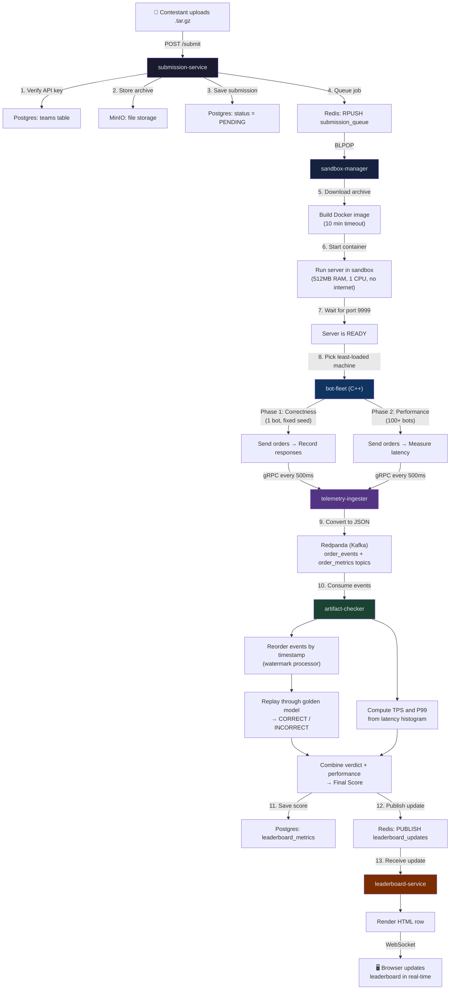

# Veltrix — Project Walkthrough

---

## What is Veltrix?

Veltrix is a **platform that automatically tests and ranks exchange servers** built by contestants in a competitive programming contest.

Contestants write a server that acts as a stock exchange — it accepts BUY/SELL/CANCEL orders and matches them. Veltrix deploys each server, throws realistic trading traffic at it, checks if the matching logic is correct, measures how fast it responds, and shows results on a live leaderboard.

### The Problem it Solves

Normal competitive programming judges compare your program's output to expected output. That doesn't work here because:

- The server runs continuously (it's not a one-shot program)
- Output depends on timing and order of requests (not deterministic by nature)
- We care about **speed** (throughput, latency), not just correctness
- We need to test under real concurrent load, not just single test cases

### How it Works (Short Version)

```
Contestant uploads code (.tar.gz)
    → Platform builds it in Docker
    → Runs it in a locked-down container (limited CPU, RAM, no internet)
    → Sends thousands of trading orders to it (correctness check + load test)
    → Records every request and response
    → Replays them through a trusted reference engine to verify correctness
    → Measures throughput (requests/sec) and latency (P99)
    → Updates a live leaderboard in the browser
```

### Full Flow Diagram



---

## Tech Stack (and Why)

| Component | Tech | Why this choice |
|---|---|---|
| Bot-fleet (sends orders) | C++ | Need precise latency measurement. Go/Java garbage collector pauses would add fake latency to measurements. |
| Sandbox manager | Go | Great for managing many tasks at once (goroutines). Easy Docker and Redis integration. |
| Message queue | Redpanda (Kafka-compatible) | Handles high-throughput event streaming. Groups events by submission so they stay in order. |
| Correctness checker | Go | Runs the golden-model matching engine and compares results. |
| Leaderboard | Go + HTMX + WebSocket | Live table updates without any frontend framework. Server sends HTML fragments, browser swaps them in. |
| Storage | Postgres, Redis, MinIO | Postgres for scores and status. Redis for job queue and live updates. MinIO for file storage. |

---

## The 7 Services

```
┌─────────────────┐     ┌──────────────────┐     ┌──────────────┐
│ submission-      │     │ sandbox-          │     │ bot-fleet    │
│ service          │────▶│ manager           │────▶│ (C++)        │
│ (receives code)  │     │ (builds & runs)   │     │ (sends load) │
└─────────────────┘     └──────────────────┘     └──────┬───────┘
                                                        │ gRPC
                                                        ▼
┌─────────────────┐     ┌──────────────────┐     ┌──────────────┐
│ leaderboard-     │◀────│ artifact-         │◀────│ telemetry-   │
│ service          │     │ checker           │     │ ingester     │
│ (live UI)        │     │ (checks results)  │     │ (gRPC→Kafka) │
└─────────────────┘     └──────────────────┘     └──────────────┘
                              ▲
                              │
                         ┌────┴─────┐
                         │ Redpanda │
                         │ (Kafka)  │
                         └──────────┘
```

---

## Step-by-Step Flow

### Step 1 — Contestant Submits Code (`submission-service`)

```bash
curl -X POST http://localhost:8080/submit \
  -H "X-API-Key: my-team-key" \
  -F "language=cpp" \
  -F "file=@submission.tar.gz"
```

What happens:
1. Verify the API key (check team exists in Postgres)
2. Upload the archive to MinIO (file storage)
3. Save a `PENDING` row in Postgres
4. Push the submission ID into a Redis queue
5. Return `202 Accepted` immediately — all heavy work happens in the background

### Step 2 — Build and Run the Server (`sandbox-manager`)

A pool of worker goroutines picks up jobs from the Redis queue. Each worker:

1. Downloads the archive from MinIO
2. Extracts it safely (with size limits to prevent zip bombs)
3. Generates a Dockerfile based on language (C++, Rust, or Go)
4. Runs `docker build` (10-minute timeout)
5. Starts the container with strict limits:
   - 512 MB RAM
   - 1 CPU core
   - No internet access
   - All Linux capabilities dropped
6. Waits for the server to start listening on port 9999 (15-second timeout)
7. If it starts → status becomes `READY`
8. If it crashes or times out → status becomes `FAILED_STARTUP` / `FAILED_RESOURCE` / etc.

**Parallel builds:** Multiple workers build different submissions at the same time. The number of workers is tuned so builds don't fight over CPU (typically 3-4 on an 8-core machine).

### Step 3 — Run the Benchmark (`bot-fleet`, C++)

Once the server is running, the sandbox-manager tells the bot-fleet to start testing it. There are **two phases:**

**Phase 1 — Correctness (is the matching logic right?)**
- 1 bot, fixed random seed, deterministic order sequence
- Every order and every response is recorded
- These recordings are later replayed through a trusted "golden model" to check if the server matched orders correctly

**Phase 2 — Performance (how fast is it?)**
- 100+ bots sending orders concurrently
- Measures throughput (requests per second) and latency
- Latency is recorded in a histogram with 18 buckets (from 0.05ms to 1000ms)
- Timeouts are counted separately — they don't go into the histogram (otherwise they'd pollute the P99)

**How bots are assigned to CPU cores:**

Each bot-fleet machine has a "core partition manager" — a simple bitset that tracks which CPU cores are free. When a benchmark starts, it claims 2+ dedicated cores. This means two benchmarks running on the same machine never share CPU cores, so latency measurements stay accurate.

**Scaling to multiple machines:**

The sandbox-manager has a "fleet pool" that knows about multiple bot-fleet machines. When dispatching a benchmark, it picks the machine with the most free capacity. To add more capacity, just add more machines to the `FLEET_POOL_URLS` list — no code changes needed.

### Step 4 — Stream Results to Kafka (`telemetry-ingester`)

Every 500ms, each bot thread sends a batch of data via gRPC:
- **Order intents** — what orders the bot sent (BUY AAPL @ 100, qty 50)
- **Trade fills** — what the server reported back (filled against order X at price Y)
- **Metrics** — request counts, latency histogram

The telemetry-ingester converts these from protobuf to JSON and publishes them to Redpanda (Kafka) topics. The key is the `submission_id`, so all events for one submission land on the same Kafka partition and stay in order.

### Step 5 — Check Correctness and Compute Score (`artifact-checker`)

This is the brain of the system. It has 4 stages:

**Stage 1 — Watermark Processor (reorder events)**

Bot threads run independently, so their events can arrive out of order (by up to ~2 seconds). The watermark processor uses a min-heap to hold events and only releases them once it's safe — when the watermark (= latest timestamp - 2 seconds) passes them.

If no events arrive for 30 seconds, it force-flushes everything. This handles the case where the bot-fleet crashes and the "end of run" marker never arrives — without this, the submission would stay stuck as `UNVERIFIED` forever.

**Stage 2 — Replay Engine (golden-model check)**

Takes the ordered event stream and replays every order through a trusted matching engine built into the checker. For each order, it compares:
- Did the server fill the right quantity? (exact match)
- Did it pick the right counterparty? (price-time priority)
- Is the execution price reasonable? (within the valid range, not exact — different servers may report maker-price vs taker-price, both are valid)

If something doesn't match → `INCORRECT`. If data is missing → `UNVERIFIED` (never a false failure). If everything matches → `CORRECT`.

**Stage 3 — Aggregator (compute performance score)**

Merges metrics from all bot threads:
- TPS = successful requests in this window / elapsed seconds
- P50, P90, P99 latency from the histogram

Also receives the correctness verdict and attaches it to the score.

**Stage 4 — Publisher (save and broadcast)**

Writes the score to Postgres and publishes it to Redis for the leaderboard.

### Step 6 — Live Leaderboard (`leaderboard-service`)

**When a browser connects:**
- Loads the current leaderboard from Postgres
- Opens a WebSocket connection

**When a new score arrives:**
- Redis subscriber receives it
- Server renders just the one table row as HTML: `<tr id="row-abc" hx-swap-oob="true">...</tr>`
- Sends it over WebSocket to all connected browsers
- HTMX finds the row by ID and replaces it — the rest of the page doesn't change

This means the leaderboard updates in real-time with no page refresh and no frontend JavaScript framework.

---

## Status Lifecycle

```
PENDING → BUILDING → READY → RUNNING → SUCCESS
                                ├── FAILED_SYSTEM    (build failed)
                                ├── FAILED_STARTUP   (server didn't start)
                                ├── FAILED_RESOURCE  (out of memory)
                                └── FAILED_LOGIC     (crash / segfault)
```

---

## How It Scales

| What | How |
|---|---|
| Many submissions at once | Worker pool builds multiple Docker images in parallel |
| Many benchmarks at once | Fleet pool dispatches across multiple bot-fleet machines, each with dedicated CPU cores |
| Many events | Kafka partitioned by submission. One processing goroutine per active submission. |
| Many viewers | WebSocket hub broadcasts to all browsers. Redis pub/sub decouples scoring from viewing. |

To scale horizontally, add more bot-fleet machines:
```yaml
FLEET_POOL_URLS: "http://fleet-1:7070,http://fleet-2:7070,http://fleet-3:7070"
```

---

## Bugs Found and Fixed

| Bug | What went wrong | Fix |
|---|---|---|
| Stuck verdict | If bot-fleet crashed, the "end of run" signal never arrived → verdict stayed `UNVERIFIED` forever | Added a 30-second idle timer — if no events arrive for 30s, flush everything |
| Early container removal | Cleanup timer started from when we *tried* to dispatch, not from when it *actually started*. If dispatch was delayed, the container was removed too early → wrong scores | Cleanup now waits for a confirmation signal from the dispatch goroutine before starting the countdown |
| Leaked goroutines | Performance dispatch retried forever with no timeout if fleet was full | Added a 10-minute hard deadline |
| Ghost orders | 1-second timeout in correctness mode was too tight. A 1.1s response meant the bot moved on, but the server had already processed the order → shadow engine thought the order didn't exist → false `INCORRECT` | Changed to 5-second timeout in correctness mode (1s stays for performance mode) |

---

## Redis vs Redpanda — Why Both?

Redis and Redpanda do completely different jobs in this system. Here's every place each one is used, why it was picked, and why you can't swap them.

### What is Redis used for?

Redis is an **in-memory key-value store**. It's extremely fast (sub-millisecond) but doesn't store large amounts of data or replay history. We use it for 3 things:

**1. Job Queue (`submission_queue`)**

```
submission-service  →  RPUSH submission_queue "sub-abc"   (add job)
sandbox-manager     →  BLPOP submission_queue             (wait for job)
```

When a contestant uploads code, the submission-service pushes the submission ID into a Redis list. The sandbox-manager blocks on `BLPOP` (blocking pop) — it sleeps until a job appears, then immediately picks it up.

> **Why Redis?** We just need a simple FIFO queue. The message is tiny (just a submission ID string). We don't need to replay old messages or keep history. Redis lists with RPUSH/BLPOP give us a reliable queue with zero setup — no topics, no partitions, no consumer groups.

**2. Live Leaderboard Updates (`leaderboard_updates` pub/sub channel)**

```
artifact-checker    →  PUBLISH leaderboard_updates '{"submission_id":"abc","tps":4500}'
leaderboard-service →  SUBSCRIBE leaderboard_updates   (receives it instantly)
```

When the artifact-checker computes a new score, it publishes it to a Redis pub/sub channel. The leaderboard-service is subscribed — it receives the message instantly, renders an HTML table row, and pushes it to all browsers over WebSocket.

> **Why Redis?** Pub/sub is fire-and-forget — we want the leaderboard to update *right now*. If the leaderboard-service was down when a score was published, that's fine — when it comes back up, it loads the full state from Postgres anyway. We don't need message history or replay. Redis pub/sub gives us sub-millisecond delivery with no overhead.

**3. Leaderboard Snapshot (`leaderboard_state` hash)**

```
artifact-checker    →  HSET leaderboard_state "sub-abc" '{"tps":4500,"p99":1.2}'
leaderboard-service →  HGETALL leaderboard_state   (on new browser connect)
```

When a browser first connects to the leaderboard, the service needs the current state for ALL submissions — not just future updates. The `leaderboard_state` hash stores the latest score for each submission ID, so the leaderboard-service can read the whole thing in one call.

> **Why Redis?** It's a simple key-value lookup — "give me the current score for every submission." We update it in a pipeline together with the pub/sub publish (both in one Redis roundtrip). Redis hashes are perfect for this — fast reads, no schema needed.

---

### What is Redpanda used for?

Redpanda is a **Kafka-compatible event streaming platform**. It stores messages on disk in ordered logs (topics) and lets consumers read them at their own pace, replay from any offset, and work in consumer groups.

We use it for one thing — but it's the most data-heavy part of the system:

**Telemetry Event Streaming (`order_events` + `order_metrics` topics)**

```
telemetry-ingester  →  Produce to "order_events" (every order intent + fill)
                    →  Produce to "order_metrics" (latency histograms)

artifact-checker    →  Consume from both topics (fan-out by submission_id)
```

During a benchmark, every bot thread sends data every 500ms. With 100 bots, that's 200 messages/second for a single submission. With 10 submissions running, that's 2000 messages/second — each containing arrays of order intents, trade fills, and latency histograms. This is a high-throughput stream.

> **Why Redpanda (Kafka) and not Redis?**
> 
> - **Volume**: Thousands of events per second, each with detailed order data. Redis pub/sub would drop messages if the consumer falls behind — there's no buffer. Kafka stores everything on disk.
> - **Consumer groups**: The artifact-checker uses a Kafka consumer group. If it crashes and restarts, it resumes from where it left off — no lost events. Redis pub/sub has no memory — if you weren't listening, the message is gone.
> - **Ordering per submission**: Kafka key = `submission_id`. All events for one submission go to the same partition, so they arrive in order. The artifact-checker needs events in order to do the golden-model replay correctly.
> - **Replay**: If we need to debug a correctness verdict, we can replay the Kafka topic from the beginning. Redis pub/sub is fire-and-forget — once delivered, it's gone.
> - **Backpressure**: If the artifact-checker is slow, Kafka holds the messages. The telemetry-ingester keeps producing without blocking. With Redis pub/sub, slow consumers just miss messages.

---

### Side-by-Side: Why you can't swap them

| Feature needed | Redis | Redpanda (Kafka) | Used where |
|---|---|---|---|
| Simple job queue (push/pop) | ✅ RPUSH/BLPOP — perfect | ❌ Overkill, needs topics + consumer groups just for one ID | `submission_queue` |
| Fire-and-forget notifications | ✅ Pub/sub — instant, zero setup | ❌ Would need a consumer group, offset tracking — too heavy for "ping the UI" | `leaderboard_updates` |
| Key-value snapshot | ✅ HSET/HGETALL — perfect | ❌ Kafka is an append-only log, not a key-value store | `leaderboard_state` |
| High-throughput ordered stream | ❌ Pub/sub drops messages if consumer is slow, no replay | ✅ On-disk log, consumer groups, replay, partitioned by key | `order_events`, `order_metrics` |
| Crash recovery (resume from where you left off) | ❌ Pub/sub is fire-and-forget | ✅ Consumer group offsets survive restarts | artifact-checker consuming telemetry |
| Per-submission ordering | ❌ No built-in partitioning | ✅ Kafka key = submission_id → same partition → ordered | Correctness replay needs ordered events |

### In short

- **Redis** = fast, simple, ephemeral. Jobs, notifications, snapshots. Small data, instant delivery, no need for history.
- **Redpanda** = durable, ordered, replayable. High-volume event streams where losing a message means a wrong verdict.

---

## Docker Network Layout

```
Public ports:
  :8080  → submission-service (contestants upload here)
  :8085  → leaderboard-service (browsers connect here)

Internal network (services talk to each other):
  submission-service ←→ postgres, redis, minio
  sandbox-manager    ←→ postgres, redis, minio, docker, bot-fleet
  bot-fleet          ←→ contestant containers, telemetry-ingester
  telemetry-ingester ←→ redpanda
  artifact-checker   ←→ redpanda, postgres, redis
  leaderboard        ←→ postgres, redis

Isolated network (contestant containers):
  sandbox-{id} ←→ bot-fleet ONLY (no internet, no access to other services)
```
